# ProReach Product Requirements Document

**Document status:** Draft for founder review  
**Version:** 1.0  
**Date:** July 30, 2026  
**Product:** ProReach  
**Document owner:** Founder / Product  
**Primary release described:** Product reset and reliable V1  

---

## How to use this PRD

This document is intended to become the working product source of truth. Product, design, and engineering decisions should be checked against the goals, principles, priorities, and acceptance criteria below. Existing implementation does not automatically make a capability P0, and a P0 label does not imply that the current implementation is production-ready.

The recommended review order is:

1. Approve or revise the product reset in Sections 1–3.
2. Confirm the initial customer in Section 5.
3. Approve the goals and targets in Section 8.
4. Confirm P0/P1/P2 scope in Section 9.
5. Resolve the founder-level decisions in Section 24.
6. Convert approved P0 requirements in Section 11 into engineering epics.

### Document assumptions

- ProReach is an early-stage, founder-led product and has not yet proven repeatable retention.
- The first release is an English-language web product.
- The initial workspace has one owner; team roles are a later capability.
- ProReach is the platform brand. Prophrase, Prophase, and other names are customer projects inside ProReach.
- The canonical production origin is `https://www.proreach.in`.
- Supabase Auth/PostgreSQL, Vercel, Cloudflare Workers AI, Cloudflare R2, and provider APIs are current implementation choices, not immutable elements of the product vision.
- All numerical targets are product hypotheses until supported by observed user data.
- Provider support means successful OAuth and publishing for eligible real users, not merely the presence of an integration card or mocked contract test.

### Contents

- [Executive summary](#1-executive-summary)
- [Product reset decision](#2-product-reset-decision)
- [Vision, mission, and positioning](#3-vision-mission-and-positioning)
- [Problem definition](#4-problem-definition)
- [Target customers and personas](#5-target-customers-and-personas)
- [Jobs to be done](#6-jobs-to-be-done)
- [Product principles](#7-product-principles)
- [Goals and success measures](#8-goals-and-success-measures)
- [Scope and prioritization](#9-scope-and-prioritization)
- [End-to-end user experience](#10-end-to-end-user-experience)
- [Detailed functional requirements](#11-detailed-functional-requirements)
- [Post lifecycle and business rules](#12-post-lifecycle-and-business-rules)
- [Data model requirements](#13-data-model-requirements)
- [AI requirements and guardrails](#14-ai-requirements-and-guardrails)
- [Security, privacy, and trust](#15-security-privacy-and-trust-requirements)
- [Reliability and operations](#16-reliability-and-operational-requirements)
- [UX and content requirements](#17-ux-and-content-requirements)
- [Product analytics and experimentation](#18-product-analytics-and-experimentation)
- [Rollout plan](#19-rollout-plan)
- [Milestone roadmap](#20-milestone-roadmap)
- [Current implementation assessment](#21-current-implementation-assessment)
- [Risks and mitigations](#22-risks-and-mitigations)
- [Dependencies](#23-dependencies)
- [Open product decisions](#24-open-product-decisions)
- [Founder validation plan](#25-founder-validation-plan)
- [Definition of V1 done](#26-definition-of-v1-done)
- [Immediate next actions](#28-immediate-next-actions)

---

## 1. Executive summary

ProReach is an approval-first AI marketing workspace for founders and lean product teams. It converts a reusable source of product truth into coordinated, channel-native social campaigns that users can edit, approve, schedule, and publish through their own social accounts.

The product should not compete as another general-purpose AI writer, social inbox, or autonomous posting bot. Its differentiated job is narrower and more valuable:

> Turn a real product website into an accurate, editable campaign and help the owner confidently publish it across the right channels—without repeatedly explaining the product or surrendering final control.

This PRD resets the roadmap around a single reliable value loop:

1. The user signs in.
2. The user creates a project by entering its website.
3. ProReach extracts an editable product source of truth.
4. The user supplies the current campaign goal and focus.
5. ProReach generates coordinated, channel-native drafts grounded in the saved context.
6. The user edits and approves each draft.
7. The user connects the project’s social accounts through OAuth.
8. The user publishes immediately or schedules the approved content.
9. ProReach reports what happened and makes the next campaign easier.

The first product milestone is not “support every social network” or “generate as much content as possible.” It is:

> A qualified new user reaches an approved first campaign in under 15 minutes and can successfully publish at least one post without technical assistance.

Everything in the roadmap should be evaluated by whether it improves the speed, accuracy, confidence, or repeatability of that loop.

---

## 2. Product reset decision

### 2.1 Recommended product direction

ProReach should become the **campaign operating system for founder-led product marketing**, beginning with indie SaaS founders, small software teams, and solo product marketers who already have a real product or landing page but struggle to turn product knowledge into consistent social campaigns.

The product should emphasize four advantages:

1. **Product-grounded:** Every campaign begins from saved, editable product truth rather than a blank prompt.
2. **Campaign-coordinated:** ProReach creates a coherent campaign across platforms rather than unrelated one-off posts.
3. **Channel-native:** Each draft is adapted for the norms, constraints, and audience expectations of its destination.
4. **Human-approved:** Nothing is published until a person reviews the claims, creative, destination, and timing.

### 2.2 What ProReach is not

ProReach is not:

- A generic AI chat interface.
- A fully autonomous “set it and forget it” social bot.
- A replacement for product positioning, customer research, or human judgment.
- A social listening, support inbox, or community-management suite.
- An advertising campaign manager.
- A CRM, email marketing platform, or sales engagement tool.
- A tool for automated comments, replies, direct messages, or artificial engagement.
- A full professional image or video editor.
- A promise of guaranteed reach, engagement, leads, conversions, or revenue.

### 2.3 Why this reset is necessary

The existing application demonstrates many technically valuable capabilities: website analysis, structured project context, campaign generation, deterministic branded media, multiple OAuth providers, approval states, scheduling, and publishing. However, the product risks becoming a collection of capabilities before the core activation loop is proven.

The reset prioritizes:

- Successful onboarding over the number of editable fields.
- Draft usefulness over generation volume.
- Reliable publishing over the number of nominal integrations.
- Clear project ownership over administrator-facing technical setup.
- User confidence over autonomous behavior.
- Activation and retention over signups or impressions.

---

## 3. Vision, mission, and positioning

### 3.1 Vision

Every useful product should be able to communicate clearly and consistently without requiring its founder to become a full-time content operator.

### 3.2 Mission

Help founders and lean teams turn product truth into accurate, coordinated marketing campaigns while preserving human control over every public claim and publishing decision.

### 3.3 Category

Approval-first AI marketing workspace.

### 3.4 Positioning statement

For founders and lean product teams who need to market consistently across social channels, ProReach is an approval-first AI marketing workspace that turns a reusable source of product truth into coordinated, channel-native campaigns. Unlike generic AI writers and autonomous posting tools, ProReach grounds every draft in editable product context and keeps a person in control of claims, creative, destination, and publishing.

### 3.5 Core promise

Turn product truth into a campaign you can confidently publish.

### 3.6 Brand promise

Make your product impossible to ignore—without making things up.

---

## 4. Problem definition

### 4.1 Primary customer problem

Founders and lean marketers often know their product deeply but cannot consistently convert that knowledge into high-quality social campaigns. Each content session begins from a blank page. Product facts, positioning, customer pain, proof, tone, and current priorities live across the website, documents, founder memory, and old posts. Generic AI tools require the same context repeatedly and often produce disconnected, exaggerated, or channel-inappropriate content.

### 4.2 Current alternatives and their weaknesses

| Alternative | Why users choose it | Core weakness ProReach addresses |
|---|---|---|
| Writing manually | Maximum control and authenticity | Slow, inconsistent, and difficult to sustain across channels |
| Generic AI chat | Fast first draft | Repeated prompting, weak memory, invented claims, and no publishing workflow |
| Social schedulers | Reliable calendar and publishing | Usually begin after content already exists and do not deeply understand the product |
| AI social generators | High content volume | Generic output, shallow context, weak campaign coherence, and excessive automation |
| Agencies or freelancers | Expertise and execution | Expensive, slower feedback loops, and knowledge-transfer overhead |
| Doing nothing | Avoids low-quality content | Product remains invisible and launches lose momentum |

### 4.3 User pain points

- “I do not know what to post this week.”
- “I have to explain my product to AI every time.”
- “The drafts sound generic and could belong to any company.”
- “AI invents capabilities, proof, or outcomes I cannot claim.”
- “The same post does not work on LinkedIn, X, Instagram, and Threads.”
- “Creating visuals takes longer than writing the post.”
- “Connecting social platforms is confusing and feels technical.”
- “I am worried an automation will publish the wrong thing.”
- “I can create content once, but I cannot maintain a repeatable system.”
- “My tools separate writing, design, review, scheduling, and publishing.”

### 4.4 Opportunity

ProReach can own the space between product knowledge and social execution. It can store a trusted product model, convert a timely objective into a coordinated campaign, make review safe and efficient, and complete the last mile to publishing. The durable asset is not the generated text; it is the combination of trusted project context, user corrections, campaign history, brand constraints, connected destinations, and operational workflow.

---

## 5. Target customers and personas

### 5.1 Initial ideal customer profile

The initial ICP is:

- A founder, indie builder, solo product marketer, or marketing generalist.
- Responsible for marketing a software product, digital product, service platform, or productized service.
- Has a live website or sufficiently complete landing page.
- Publishes or intends to publish on two or more social channels.
- Has limited time and no dedicated content team.
- Values accuracy and brand control more than maximum automation.
- Needs recurring campaigns around launches, features, education, proof, or building in public.

The first release should optimize for English-language, founder-led B2B SaaS and product businesses. Other segments may use the product, but they should not dictate V1 requirements until activation is proven.

### 5.2 Primary persona: founder-operator

**Profile:** Founder or indie builder with a live product and limited marketing support.

**Goals:**

- Maintain a credible presence while building the product.
- Launch features and explain product value clearly.
- Reuse product knowledge without repeatedly briefing tools or freelancers.
- Publish consistently without losing several hours each week.

**Constraints:**

- Limited time.
- Incomplete marketing expertise.
- Concern about inaccurate claims.
- Irregular product and launch cadence.
- May manage multiple products.

**Success statement:** “I can create and approve a useful week of content in one focused session.”

### 5.3 Secondary persona: lean product marketer

**Profile:** A single marketer or very small team supporting one or more products.

**Goals:**

- Translate positioning into coordinated channel execution.
- Keep campaigns consistent while adapting them by platform.
- Review drafts efficiently with a founder or product owner.
- Preserve approved proof and brand guidelines.

**Constraints:**

- Limited design or copy resources.
- Multiple stakeholders and factual dependencies.
- Needs repeatable planning and review.

**Success statement:** “The product context remains accurate, the campaign is coherent, and review is faster.”

### 5.4 Future persona: boutique agency or fractional marketer

**Profile:** A consultant or agency operator managing several customer brands.

This persona is strategically attractive because ProReach already supports multiple project-scoped brands. It is not the primary V1 persona because agencies introduce additional requirements: team roles, client approvals, billing boundaries, white labeling, account transfer, and higher operational expectations.

### 5.5 Explicitly excluded initial personas

- Large enterprise social teams requiring complex permissions and compliance workflows.
- Consumer creators primarily seeking viral entertainment content.
- Users seeking automated engagement, scraping, or unsolicited outreach.
- Businesses without a real product, website, or sufficiently defined offer.
- Performance-advertising teams requiring ad account management.

---

## 6. Jobs to be done

### 6.1 Primary job

When I need to market my product this week, help me turn what is true about the product and what matters now into a coordinated campaign I can confidently approve and publish, so I can stay visible without becoming a full-time content manager.

### 6.2 Supporting jobs

- When I start a new project, extract a useful first version of its marketing context from the website so I do not face a long blank form.
- When the product changes, let me correct its source of truth once so future campaigns use the new facts.
- When I have a launch or timely idea, convert it into platform-specific drafts without losing the shared campaign thesis.
- When AI produces a draft, show it in an editable review state and make unsupported claims easy to identify.
- When I connect a social account, use a familiar provider OAuth flow and store the connection only under the selected project.
- When I approve content, let me choose the exact destination and timing before anything is published.
- When publishing fails, tell me what happened, preserve my content, and provide a safe recovery path.
- When I return next week, help me build on previous campaigns rather than restart from zero.

---

## 7. Product principles

### 7.1 Truth before fluency

A less polished factual draft is better than a persuasive invented claim. Product context, proof, explicit constraints, and user corrections form the factual boundary for generation.

### 7.2 Campaigns before isolated posts

The user should begin with an objective, audience, thesis, and timely focus. Posts are coordinated expressions of that strategy, not unrelated outputs.

### 7.3 Native adaptation before copy-paste distribution

An idea may cross platforms; identical copy should not. Length, hook, structure, CTA, hashtags, media expectations, and voice must adapt to the destination.

### 7.4 Approval before publication

Generation, approval, scheduling, and publishing are distinct actions. Approval must never silently publish. The final destination and timing must be explicit.

### 7.5 OAuth, not technical configuration, for project users

Provider application credentials belong to the ProReach platform and are configured once by administrators. Project users only see “Connect with [provider],” provider consent, destination selection, verification, reconnect, and disconnect.

### 7.6 Project boundaries are product boundaries

Product context, logos, campaigns, drafts, connections, destinations, media, and metrics must remain scoped to the selected project. ProReach’s central brand and customer brands must never be mixed.

### 7.7 Editability is a core feature

AI output is a proposal. Every generated context field, campaign draft, CTA, hashtag, visual direction, schedule, and destination must be reviewable before it becomes public.

### 7.8 Reliability before breadth

A smaller set of dependable integrations is more valuable than five cards that cannot complete OAuth or publishing. A provider should be presented as available only when the platform configuration, permissions, and production flow are ready.

### 7.9 Explain the next action, not the infrastructure

User-facing errors should tell the user what happened and what to do. Database columns, environment variables, client secrets, provider payloads, and framework errors must not appear in the normal product experience.

---

## 8. Goals and success measures

### 8.1 Primary V1 goal

Enable a qualified user to create a trustworthy product profile, generate a coordinated campaign, approve at least one draft, and successfully publish or schedule it with minimal assistance.

### 8.2 North-star activation event

An **activated user** is a new signed-in user who, within seven days:

1. Creates a real project.
2. Saves sufficiently complete product context.
3. Generates at least one campaign.
4. Approves at least one draft.

Publishing is measured separately because provider reviews and account eligibility can create external blockers. The stronger “fully activated” milestone includes a successful first publish or schedule.

### 8.3 V1 target metrics

These are initial hypotheses and should be revised after the first 20–50 qualified users.

| Metric | Initial target | Why it matters |
|---|---:|---|
| Website analysis completion | ≥ 85% of supported public sites | Reduces onboarding abandonment |
| Website-to-editable-profile time | Median under 90 seconds | Demonstrates immediate value |
| Signup-to-project-created | ≥ 60% | Tests onboarding clarity |
| Signup-to-first-campaign | ≥ 40% | Tests the core value proposition |
| Signup-to-first-approved-draft | ≥ 30% | North-star activation |
| Median time to first approved draft | Under 15 minutes | Measures activation speed |
| Draft acceptance with no more than light edits | ≥ 60% | Measures grounded generation quality |
| OAuth completion for enabled providers | ≥ 80% of starts | Measures integration usability |
| Supported-provider publish success | ≥ 98%, excluding provider outages | Measures operational reliability |
| Scheduled posts published within five minutes | ≥ 99% | Measures scheduler reliability |
| Seven-day activated-user retention | ≥ 25% | Tests recurring value |
| Four-week activated-user retention | ≥ 15% initially | Tests durable workflow value |
| Critical cross-project data incidents | 0 | Non-negotiable trust requirement |

### 8.4 Business goals

- Prove that users return for a second campaign without founder-led assistance.
- Identify one ICP and one recurring use case with materially higher retention.
- Establish the willingness to pay for saved context, campaign generation, and reliable multi-channel execution.
- Create a product foundation that can later support team collaboration and agency accounts without breaking project ownership.

### 8.5 Non-goals for V1

- Maximizing the number of generated posts.
- Supporting every social network.
- Building a full analytics suite.
- Automatically optimizing campaigns without user review.
- Replacing a social community manager.
- Supporting enterprise procurement, SSO, or complex approval hierarchies.
- Building native mobile applications.
- Promising or optimizing for viral reach.

---

## 9. Scope and prioritization

### 9.1 Priority definitions

- **P0 — Required for reliable V1:** The core loop is incomplete or unsafe without it.
- **P1 — Required for repeatable retention:** Important after activation is reliable.
- **P2 — Expansion:** Adds scale, collaboration, or differentiation after retention is demonstrated.
- **Deferred:** Explicitly outside the current roadmap.

### 9.2 P0 scope

- Google/Supabase authentication and private workspace ownership.
- Project creation through website-first autofill.
- Complete editable product source of truth and logo upload.
- Project switching with strict isolation.
- Campaign generation from saved context plus current goal and focus.
- Platform-specific drafts for selected channels.
- Draft editing, approval, destination choice, immediate publish, and scheduling.
- Reliable social OAuth for production-enabled providers.
- Connection verification, reconnect, destination selection, and disconnect.
- Branded image generation for formats that require or benefit from media.
- Content calendar and explicit post status.
- Safe failure handling and retry paths.
- Usage limits and provider availability controls.
- Product analytics for the activation funnel.
- Production environment and schema validation.

### 9.3 P1 scope

- Campaign history and duplication.
- Reuse of high-performing themes and previous approved language.
- Basic post-level performance metrics where provider permissions allow.
- Weekly planning suggestions derived from project goals and campaign history.
- Notifications for review, scheduled publishing, failure, and expiring connections.
- Context freshness prompts when a website or product changes.
- Simple campaign templates for launches, feature education, founder story, proof, and comparison.
- Better media variants, carousels, and destination previews.
- Subscription plans and usage enforcement.
- Data export and account deletion workflow.

### 9.4 P2 scope

- Team invitations, roles, comments, and multi-step approvals.
- Agency/client workspaces and project transfer.
- Brand asset library beyond one logo.
- Multiple languages and localization.
- Recommendation loops using approved performance data.
- Native video rendering and publishing.
- Webhooks and deeper provider event synchronization.
- Public share links for client review.
- API access and automation integrations.

### 9.5 Deferred scope

- Automated replies, comments, DMs, and engagement.
- Social listening and unified inbox.
- Paid-ad management.
- Influencer discovery or outreach.
- CRM and sales automation.
- Full design-canvas replacement.
- Fully autonomous global autopilot.
- Scraping restricted or private content.

---

## 10. End-to-end user experience

```mermaid
flowchart LR
    A["Google sign-in"] --> B["Create or select project"]
    B --> C["Enter website"]
    C --> D["AI-prefilled product truth"]
    D --> E["Review, edit, upload logo"]
    E --> F["Choose campaign goal and platforms"]
    F --> G["Generate coordinated drafts"]
    G --> H["Edit and approve"]
    H --> I["Connect project account with OAuth"]
    I --> J["Choose destination"]
    J --> K{"Publish decision"}
    K -->|Now| L["Publish and record result"]
    K -->|Later| M["Schedule and publish by worker"]
    L --> N["Learn and plan next campaign"]
    M --> N
```



### 10.1 First-session happy path

1. The visitor understands the product promise from the landing page.
2. The visitor signs in with Google.
3. The empty workspace asks for the product website, not a long blank brief.
4. ProReach reads the site, reports progress, and prefills all context sections.
5. The user reviews and corrects the extracted information.
6. The user uploads the exact logo and saves the project.
7. The workspace immediately offers “Generate first campaign.”
8. The user confirms the campaign goal, timely focus, instructions, and platforms.
9. ProReach returns a coherent set of drafts with appropriate formats.
10. The user opens a draft, edits it, and approves it.
11. If the destination is not connected, the product takes the user to Connections.
12. The user presses “Connect with X,” “Connect with LinkedIn,” or another enabled provider.
13. The provider handles login and consent.
14. ProReach saves the grant under the selected project and asks the user to choose among returned Pages or profiles when necessary.
15. The user returns to the approved draft, selects the destination, and chooses Post now or Schedule.
16. ProReach records the result and shows a remote post link or clear failure recovery.

### 10.2 Returning-user weekly path

1. The user opens the active project.
2. ProReach shows scheduled work, drafts awaiting review, recent publishing results, and a clear next action.
3. The user starts a new campaign with the saved default goal already populated.
4. The user adds only what is timely: launch, feature, insight, proof, event, or priority.
5. ProReach avoids obvious repetition from recent campaigns.
6. The user edits, approves, schedules, and leaves.

### 10.3 Multi-project path

1. The user switches from Project A to Project B.
2. The entire workspace reloads within the Project B boundary.
3. No Project A context, campaigns, social accounts, media, destinations, or metrics appear.
4. A new provider connection initiated in Project B is stored only in Project B, even when the same provider identity is also connected elsewhere.

---

## 11. Detailed functional requirements

### 11.1 Authentication and workspace ownership

#### AUTH-001 — Google sign-in

**Priority:** P0  
**Requirement:** Users must authenticate through Google using Supabase Auth before accessing the workspace.

**Acceptance criteria:**

- The login action begins OAuth from the current application origin.
- Local callbacks remain on localhost; production callbacks remain on the canonical production host.
- Successful authentication creates or resolves one private workspace for the Supabase user ID.
- Unauthenticated requests to protected pages and APIs are redirected or rejected.
- Authentication errors show a user-readable retry path without exposing provider payloads.

#### AUTH-002 — Private workspace boundary

**Priority:** P0  
**Requirement:** Every user-owned entity must be derived from the authenticated user’s workspace.

**Acceptance criteria:**

- A user cannot read, update, publish, connect, or delete another user’s data by changing an ID.
- All project, campaign, post, OAuth, connection, and publishing queries verify workspace ownership.
- Cross-workspace access tests exist for sensitive repositories and APIs.
- No public Supabase role can access application tables without an approved policy.

#### AUTH-003 — Sign out

**Priority:** P0  
**Requirement:** Users can terminate the ProReach session from the workspace.

**Acceptance criteria:**

- Sign out clears the Supabase session.
- The user returns to a public route.
- Previously protected routes require authentication again.

### 11.2 Project creation and website autofill

#### PROJ-001 — Website-first project creation

**Priority:** P0  
**Requirement:** The primary project onboarding action must begin with a website URL and generate an editable first draft of project context.

**Acceptance criteria:**

- The user can enter a domain with or without a URL scheme.
- ProReach normalizes and validates the URL.
- ProReach reads only publicly accessible pages using safe fetch controls.
- The UI displays progress and prevents duplicate submissions.
- Successful analysis fills every applicable project section.
- The user is told how many pages were analyzed.
- No generated field is saved until the user reviews and submits the project.
- Failed analysis preserves the entered URL and allows manual completion or retry.

#### PROJ-002 — Safe website collection

**Priority:** P0  
**Requirement:** Website analysis must not become a server-side request-forgery path or unrestricted crawler.

**Acceptance criteria:**

- Private IP ranges, localhost, unsupported protocols, credentials in URLs, and unsafe redirects are rejected.
- Crawl depth, page count, response size, content type, and total processing time are bounded.
- Only relevant same-site public content is considered.
- The system does not bypass authentication, paywalls, robots restrictions, or access controls.
- Retrieved website text is treated as untrusted input.

#### PROJ-003 — Structured product truth

**Priority:** P0  
**Requirement:** Each project stores a reusable, editable source of truth.

**Required fields:**

- Product name.
- Website.
- One-line promise.
- Product description.
- Customer problem.
- Product solution.
- Target audience.
- Audience pain points.
- Primary use cases.
- Key features.
- Differentiators.
- Verified proof points.
- Competitors or alternatives.
- Brand voice.
- Tone guidelines.
- Preferred words.
- Words to avoid.
- Primary marketing goal.
- Default CTA.
- Additional constraints and current context.

**Acceptance criteria:**

- Required fields have meaningful minimum validation.
- Lists remain structured as lists, not lossy comma-separated text.
- Users can navigate backward and forward without losing changes.
- Context is editable after project creation.
- All future campaigns use the latest saved version.
- The interface clearly distinguishes verified facts from aspirational positioning.

#### PROJ-004 — Logo management

**Priority:** P0  
**Requirement:** Users can upload the project’s exact logo independently of AI-generated media.

**Acceptance criteria:**

- PNG, JPEG, and WebP are supported up to the documented size limit.
- File type and size are validated server-side.
- The user sees a preview before saving.
- Replacing a logo updates future media without altering existing published assets.
- AI image generation never redraws or invents the logo.

#### PROJ-005 — Project uniqueness and switching

**Priority:** P0  
**Requirement:** A user can maintain multiple named projects and switch the active boundary.

**Acceptance criteria:**

- Duplicate project names are rejected case-insensitively within one workspace.
- The active project is visible in the global workspace header.
- Switching projects reloads campaigns, drafts, connections, destinations, context, and calendar.
- URLs may identify the selected project without allowing unauthorized access.

### 11.3 Campaign strategy and generation

#### CAMP-001 — Campaign brief

**Priority:** P0  
**Requirement:** Campaign generation begins with a lightweight current brief layered onto saved project context.

**Required inputs:**

- Project ID.
- Campaign goal.
- Timely focus or angle.
- Additional instructions and exclusions.
- Selected platforms.

**Acceptance criteria:**

- The project’s default goal pre-populates the form.
- Connected platforms are suggested but connection is not required for drafting.
- At least one platform is required.
- Inputs have bounded lengths and clear help text.
- The user can cancel without generating or consuming quota.

#### CAMP-002 — Grounded campaign output

**Priority:** P0  
**Requirement:** Generated campaigns must remain inside the saved product truth and explicit campaign brief.

**Acceptance criteria:**

- The campaign has a coherent name, thesis, and audience.
- Every post references only supported features, proof, and outcomes.
- Unsupported statistics, testimonials, integrations, customers, and guarantees are prohibited.
- Words-to-avoid and tone constraints are applied.
- The generator returns validated structured data or a controlled error.
- Failed generation does not create partial campaign records or consume quota permanently.

#### CAMP-003 — Platform-native adaptation

**Priority:** P0  
**Requirement:** Each platform receives a native version of the campaign idea.

**Acceptance criteria:**

- Hooks, body structure, CTA, hashtags, and media recommendations vary by platform.
- Drafts respect configured platform length and publishing constraints.
- Cross-platform drafts remain recognizably part of the same campaign.
- The system does not claim support for a format the publishing adapter cannot send.
- Users can generate a version for an unconnected platform and connect it later.

#### CAMP-004 — Campaign history

**Priority:** P1  
**Requirement:** Users can view previous campaigns and reuse or duplicate a campaign brief.

**Acceptance criteria:**

- Campaigns are ordered by recency.
- The user can inspect the original goal, focus, platforms, and results.
- Duplicating a campaign creates new drafts and never overwrites prior posts.
- Recent themes and visual styles can be supplied to generation to reduce repetition.

### 11.4 Draft review and approval

#### POST-001 — Draft studio

**Priority:** P0  
**Requirement:** All generated posts enter an editable draft or review state.

**Acceptance criteria:**

- The user can view platform, pillar, hook, body, CTA, hashtags, media, and status.
- The user can edit copy before approval.
- Saving an edit does not publish or schedule the post.
- Validation respects the target platform’s constraints.
- Failed saves preserve the user’s edits in the interface when possible.

#### POST-002 — Approval

**Priority:** P0  
**Requirement:** A human must explicitly approve a draft before it can be published or scheduled.

**Acceptance criteria:**

- Approval is a distinct user action.
- Approval alone does not contact a social provider.
- Changing approved copy, CTA, hashtags, media, or destination returns the post to review and requires explicit re-approval. Changing only a future schedule time may preserve approval.
- The audit trail records approval time and, when teams exist, approver identity.
- Unapproved posts cannot be published through API manipulation.

#### POST-003 — Variant creation

**Priority:** P1  
**Requirement:** A user can adapt an existing approved idea into another platform version.

**Acceptance criteria:**

- The source post remains unchanged.
- The variant uses the destination platform’s format and limits.
- The variant starts in draft/review state.
- The relationship to the source post is retained for future reporting.

### 11.5 Creative and media

#### MEDIA-001 — Branded static visual

**Priority:** P0 for Instagram; P1 for other channels  
**Requirement:** ProReach can generate a branded social visual grounded in the project context and post concept.

**Acceptance criteria:**

- The visual begins from an explicit creative archetype and product mechanism.
- Generative imagery contains no required readable text or logo.
- ProReach overlays exact copy and the uploaded logo deterministically.
- Output uses a documented social aspect ratio and file format.
- The media URL is publicly accessible when required by provider publishing APIs.
- Regeneration creates a new asset without corrupting the current post.

#### MEDIA-002 — Creative safety

**Priority:** P0  
**Requirement:** Visual generation must follow product and brand constraints.

**Acceptance criteria:**

- No invented testimonials, metrics, product UI, integrations, or certifications appear.
- No realistic faces, hands, celebrity likenesses, or misleading stock-like people are generated under the current creative policy.
- Generated backgrounds reserve a safe typography area.
- The system falls back to a deterministic renderer when premium generation fails.

#### MEDIA-003 — Carousel and motion

**Priority:** P1/P2  
**Requirement:** Users can generate multi-frame and motion variants where provider publishing support is reliable.

**Acceptance criteria:**

- Each frame has a clear role in one narrative.
- Preview accurately represents the published asset.
- The UI does not offer native video publishing until an accepted provider-compatible encoder and upload path exist.

### 11.6 Social OAuth and connections

#### OAUTH-001 — Platform-owned provider configuration

**Priority:** P0  
**Requirement:** OAuth application IDs, secrets, callbacks, scopes, and review status are administrator configuration, never project-user input.

**Acceptance criteria:**

- Client IDs and secrets never appear as editable project fields.
- Missing platform configuration produces an unavailable state, not a developer setup form.
- Production deployment validation detects missing credentials for providers declared generally available.
- Secrets remain server-only and are never included in client bundles or logs.

#### OAUTH-002 — Project OAuth connection

**Priority:** P0  
**Requirement:** From a selected project, the user can click “Connect with [provider]” and complete provider-hosted OAuth.

**Acceptance criteria:**

- The OAuth session stores workspace, project, provider, expiry, and a one-time state hash.
- A separate short-lived browser binding prevents callback theft or cross-browser replay.
- PKCE is used for X and any provider requiring it.
- The callback consumes the session exactly once.
- The returned grant is encrypted before storage.
- The connection is saved only under the initiating project.
- The user returns to that project’s Connections view.

#### OAUTH-003 — Destination discovery and selection

**Priority:** P0  
**Requirement:** ProReach discovers eligible Pages or profiles and lets the user enable the exact publishing destinations.

**Acceptance criteria:**

- Facebook returns manageable Pages with publishing capability.
- Instagram accepts eligible professional accounts.
- X and Threads return the authenticated profile.
- LinkedIn distinguishes personal identity from administered organization Pages.
- When one eligible destination is returned, it is enabled automatically.
- When multiple destinations are returned, the user explicitly selects at least one.
- When zero destinations are returned, the user sees eligibility guidance rather than an empty selector.

#### OAUTH-004 — Verify, reconnect, and disconnect

**Priority:** P0  
**Requirement:** Users can maintain connection health without seeing token details.

**Acceptance criteria:**

- Verify makes a live provider identity call and refreshes an eligible token when necessary.
- UI state updates do not cause framework errors or render-time state mutations.
- Failed verification changes the connection status and recommends reconnecting.
- Reconnect replaces the stored grant without changing project ownership.
- Disconnect attempts provider revocation where supported and always deletes local encrypted credentials.
- Disconnecting one project does not affect the same provider identity connected to another project.

#### OAUTH-005 — Provider availability

**Priority:** P0  
**Requirement:** A provider is presented as usable only when the production app configuration and intended permission path are ready.

**Acceptance criteria:**

- Configured and unconfigured states are server-derived.
- Unavailable cards explain that OAuth is not enabled; they do not ask users for secrets.
- Provider-specific eligibility, review, or billing constraints are documented for administrators.
- The product can temporarily disable new connections without deleting existing grants.

### 11.7 Publishing and scheduling

#### PUB-001 — Destination-specific publishing decision

**Priority:** P0  
**Requirement:** After approval, the user must select a compatible enabled destination and choose Post now or Schedule.

**Acceptance criteria:**

- Only destinations belonging to the selected project are shown.
- Only destinations compatible with the post platform are selectable.
- The interface clearly separates approval from publishing.
- The final dialog shows destination, timing, media presence, and any blocking issue.
- The server repeats all ownership, status, and compatibility checks.

#### PUB-002 — Immediate publishing

**Priority:** P0  
**Requirement:** “Post now” sends an approved post to the selected provider immediately.

**Acceptance criteria:**

- The action is idempotent or safely guarded against duplicate clicks.
- The post enters publishing state before the external call.
- Success records remote post ID, remote URL, timestamp, and publishing event.
- Failure records a sanitized reason and returns the post to a recoverable state.
- The user receives a direct link when the provider supplies one.

#### PUB-003 — Scheduled publishing

**Priority:** P0  
**Requirement:** Users can schedule an approved post for a future time.

**Acceptance criteria:**

- The selected time is unambiguous in the user’s timezone.
- Past times are rejected.
- A scheduled post retains its exact destination.
- The scheduler atomically claims due posts so overlapping workers cannot publish duplicates.
- Retry count and failure reason are recorded.
- A permanently failed post remains visible with a recovery action.

#### PUB-004 — Retry and idempotency

**Priority:** P0 before broad production usage  
**Requirement:** Publishing must tolerate timeouts, worker overlap, and uncertain provider responses.

**Acceptance criteria:**

- Every attempt has an internal event record.
- Provider idempotency capabilities are used where available.
- An uncertain timeout does not automatically create an unbounded retry loop.
- Retries use bounded exponential backoff.
- Repeated failures stop and require user or operator action.

### 11.8 Calendar, history, and performance

#### CAL-001 — Content calendar

**Priority:** P0  
**Requirement:** Users can view scheduled and unscheduled project posts in a time-oriented workspace.

**Acceptance criteria:**

- Scheduled posts appear on the correct local date and time.
- Draft, review, approved, scheduled, publishing, published, and failed states are visually distinct.
- Switching projects changes the calendar boundary.
- Empty states provide the appropriate next action.

#### PERF-001 — Publishing history

**Priority:** P0  
**Requirement:** Users can see whether a post was published and access the remote result.

**Acceptance criteria:**

- Published time, destination, platform, and remote URL are retained.
- Failed posts expose a user-readable reason and recovery action.
- Internal provider payloads and secrets are not displayed.

#### PERF-002 — Basic performance metrics

**Priority:** P1  
**Requirement:** Where permissions and provider cost allow, ProReach collects a minimal consistent metric set.

**Initial metrics:**

- Impressions or views.
- Reactions or likes.
- Comments.
- Shares or reposts.
- Link clicks when reliably available.

**Acceptance criteria:**

- Metrics retain source platform and collection date.
- Missing metrics are shown as unavailable, not zero.
- Cross-platform comparisons explain metric differences.
- Recommendations are not generated until data quality is sufficient.

### 11.9 Usage limits and billing readiness

#### LIMIT-001 — Daily generation controls

**Priority:** P0  
**Requirement:** Website analysis, campaign generation, and image generation use server-enforced daily limits.

**Acceptance criteria:**

- Reservation is atomic per workspace and UTC date.
- A failed operation releases its reservation where safe.
- Limit errors are distinguishable from provider outages.
- Users receive a clear reset expectation.
- Limits are configurable without code changes.

#### BILL-001 — Subscription readiness

**Priority:** P1  
**Requirement:** The ownership and usage model must support future plans without changing project boundaries.

**Potential plan dimensions:**

- Projects per workspace.
- Campaign generations per month.
- Image generations per month.
- Connected destinations.
- Scheduled posts.
- Team members.
- Analytics retention.

Pricing is an open product decision and is not specified in V1.

### 11.10 Administration and deployment

#### OPS-001 — Environment separation

**Priority:** P0  
**Requirement:** Local and production application origins must never mix, while local development may intentionally use Supabase PostgreSQL.

**Acceptance criteria:**

- Local application routes use `http://localhost:3000`.
- Production routes use the canonical ProReach production origin.
- Vercel production always uses Supabase PostgreSQL.
- Local startup validates local origins and either local PostgreSQL or the matching Supabase project.
- Production build validation rejects local origins, local databases, mismatched Supabase projects, and missing required services.

#### OPS-002 — Database migrations

**Priority:** P0  
**Requirement:** Schema changes must have a repeatable production migration process.

**Acceptance criteria:**

- Every schema change has a numbered migration.
- Applied migrations are tracked or independently verifiable.
- Application deployment cannot silently assume a missing column.
- Migrations are backward-compatible where zero-downtime deployment requires it.
- Destructive migrations require backup and explicit approval.
- The repository baseline schema reflects the latest migrations for new installations.

#### OPS-003 — Product-facing errors

**Priority:** P0  
**Requirement:** Technical failures must be translated into actionable user messages.

**Acceptance criteria:**

- Users never see raw SQL, environment variable values, access tokens, or framework stack traces in production.
- OAuth errors distinguish unavailable configuration, user cancellation, eligibility, expired session, and provider failure.
- AI errors distinguish invalid website, unsupported site, usage limit, model limit, and transient service failure.
- Every recoverable error offers retry, reconnect, edit, or contact-support guidance.

---

## 12. Post lifecycle and business rules

### 12.1 Post states

```text
draft -> review -> approved -> scheduled -> publishing -> published
                    |              |             |
                    |              |             -> failed
                    |              -> approved (if schedule is cancelled)
                    -> review (after a material edit)
```

### 12.2 State rules

- Generated content begins in draft or review.
- Only reviewed content may become approved.
- Only approved content may be scheduled or published.
- A scheduled post must reference an enabled destination that belongs to the same project.
- A publishing worker must atomically claim the post.
- A published post is immutable as a historical record, although the remote provider may later report deletion.
- A failed post preserves copy, media, destination, attempts, and a sanitized failure reason.
- Material edits after approval should return the post to review; the exact materiality policy should initially be simple and conservative.

### 12.3 Campaign rules

- A campaign belongs to exactly one project and workspace.
- A campaign can contain multiple platform drafts.
- Deleting a project removes its campaigns and connections according to the documented retention policy.
- Reusing a campaign produces new records; it never rewrites published history.

### 12.4 Connection rules

- An integration represents one provider authorization for one project.
- A social account represents a discovered publishing destination.
- The same remote identity may be connected in multiple projects, but each grant is independently stored and revocable.
- A project user never supplies provider app credentials.
- A disconnected integration cannot be selected for new publishing.

---

## 13. Data model requirements

### 13.1 Core entities

| Entity | Purpose | Ownership |
|---|---|---|
| User identity | Supabase/Google authenticated person | Supabase Auth |
| Workspace | Private product boundary for one user initially | User |
| Project | Customer product/brand source of truth | Workspace |
| Campaign | Strategy and brief for coordinated content | Project |
| Post | Platform-specific draft and publishing state | Campaign/project |
| Integration | Encrypted provider authorization | Project |
| Social account | Discovered publishing destination | Integration/project |
| OAuth session | One-time authorization transaction | Project/workspace |
| Publishing event | Immutable operational history | Post |
| Daily metric | Provider performance snapshot | Post |
| AI daily usage | Server-enforced quota counters | Workspace/date |

### 13.2 Data quality requirements

- IDs are opaque UUIDs except event and metric sequence IDs where appropriate.
- Timestamps use timezone-aware UTC storage.
- Project names are unique case-insensitively within a workspace.
- Provider identities and destinations use provider-stable IDs, not display names.
- Free-form provider metadata remains supplemental and must not replace normalized ownership fields.
- Secrets and tokens are encrypted at rest and never returned from repository summaries.

### 13.3 Retention requirements

The following policies must be decided before paid public launch:

- How long consumed or expired OAuth sessions remain.
- How long publishing events and raw provider errors remain.
- Whether historical media is deleted when a project is deleted.
- How users export and delete their account data.
- Whether published-post metadata is retained after disconnecting a provider.
- How long raw performance payloads are retained.

Recommended initial policy:

- Delete expired OAuth sessions after 24 hours.
- Retain sanitized publishing events for 90 days.
- Retain campaign and post content until user deletion.
- Delete encrypted tokens immediately on disconnect.
- Provide account deletion before accepting paying customers.

---

## 14. AI requirements and guardrails

### 14.1 AI responsibilities

AI may:

- Extract a proposed product profile from public website text.
- Summarize audience, problem, solution, features, differentiators, and tone.
- Create a campaign thesis and platform-specific drafts.
- Suggest hooks, CTAs, hashtags, media briefs, and creative direction.
- Create text-free visual backgrounds within the creative policy.

AI may not autonomously:

- Add unverifiable proof, customers, testimonials, results, or integrations.
- Publish, schedule, connect accounts, or change destinations.
- Modify saved product truth without user confirmation.
- Use one project’s context in another project.
- Make legal, medical, financial, or regulated claims without appropriate product policy.

### 14.2 Grounding hierarchy

When inputs conflict, use this order:

1. Explicit user instructions for the current campaign, unless they violate policy.
2. Verified proof points and words-to-avoid.
3. Saved project source of truth.
4. Retrieved public website context.
5. General model knowledge only for style and non-factual connective language.

### 14.3 Output validation

- All AI responses used by application logic must be parsed against a schema.
- Invalid responses may be repaired once or retried within bounded cost.
- The user should not receive partial malformed content as a successful campaign.
- Prompts and model versions should be recorded internally for reproducibility without storing secrets.
- Generation failures must not create orphan records or permanently consume quota.

### 14.4 Human correction loop

P1 should capture useful corrections without silently training on private data:

- Which fields the user changed after website autofill.
- Which generated drafts were approved, heavily edited, or discarded.
- Which words and claims were repeatedly removed.
- Which campaign themes were intentionally reused.

This information may improve future prompts for the same project. Cross-customer training requires a separate explicit privacy and consent decision.

---

## 15. Security, privacy, and trust requirements

### 15.1 Authentication and authorization

- Every protected server action verifies the Supabase session.
- Ownership is checked server-side using the authenticated user ID.
- Project IDs supplied by the browser are never treated as authorization.
- Administrative provider configuration is inaccessible to project users.

### 15.2 OAuth security

- State values are random, hashed at rest, short-lived, and single use.
- The browser receives a separate HTTP-only, SameSite binding cookie.
- PKCE verifiers are encrypted where stored.
- Redirect URIs are exact and environment-specific.
- Callback errors do not log authorization codes or tokens.
- Token refresh and revocation occur only server-side.

### 15.3 Secret storage

- Access tokens, refresh tokens, client secrets, database credentials, R2 credentials, and encryption keys remain server-only.
- Provider grants are encrypted using authenticated encryption.
- Encryption key rotation requires a migration plan that can decrypt with the old key and re-encrypt with the new key.
- Logs must redact authorization headers, tokens, codes, cookies, and database URLs.

### 15.4 Content trust

- Users are responsible for final claims and rights, but the product must actively reduce accidental fabrication.
- Generated content should identify assumptions or missing proof during review.
- The product should not imply provider partnership or certification without evidence.
- User content must not be reused in ProReach marketing without permission.

### 15.5 Privacy controls required before general availability

- Published privacy policy and terms.
- Provider-compatible data deletion instructions or callback where required.
- Account and project deletion.
- Clear description of AI and infrastructure subprocessors.
- Defined retention policy.
- Support channel for data requests.

---

## 16. Reliability and operational requirements

### 16.1 Availability targets

Initial V1 operational targets:

- Application read availability: 99.5% monthly.
- Campaign generation success: 95% excluding invalid inputs and exhausted external quota.
- OAuth callback processing success: 99% after provider authorization, excluding provider-side denial or ineligible accounts.
- Publishing success: 98% excluding provider outages, permission revocation, and invalid destination state.
- Scheduled publish latency: 99% within five minutes of the selected time.

### 16.2 Observability

The product should produce structured operational events for:

- Authentication start/success/failure.
- Project autofill start/success/failure and pages analyzed.
- Project created and context edited.
- Campaign generation start/success/failure.
- Draft edited and approved.
- OAuth start/callback/success/failure by provider and reason class.
- Destination selection.
- Verification, refresh, reconnect, and disconnect.
- Publish requested, claimed, succeeded, failed, and retried.
- Scheduled job delay.
- AI and media quota use.

Sensitive content and secrets must not be included in analytics or logs by default.

### 16.3 Alerting

Operator alerts should cover:

- Repeated provider-wide OAuth failure.
- Sudden publishing failure-rate increase.
- Scheduler not running or accumulating overdue posts.
- Database connectivity or migration mismatch.
- R2 upload failure-rate increase.
- AI provider quota exhaustion or model failure.
- Unusual cross-workspace authorization failures.

### 16.4 Backups and recovery

- Production PostgreSQL must have automated backups.
- Destructive migrations require a verified restore point.
- R2 lifecycle and deletion policies must match database retention.
- Recovery procedures should define acceptable data loss and recovery time before paid launch.

---

## 17. UX and content requirements

### 17.1 Interaction standards

- Every primary screen has one obvious next action.
- Loading states explain what is happening and prevent duplicate actions.
- Destructive actions require confirmation.
- OAuth and publishing actions use unambiguous provider and project names.
- Empty states teach the workflow rather than showing decorative fake data.
- The application must never seed fictional projects, campaigns, metrics, or proof.

### 17.2 User-facing language

Prefer:

- “Connect with X.”
- “Sign in succeeded, but no eligible Pages were returned.”
- “Reconnect this account.”
- “The daily website-analysis limit has been reached.”
- “This post is approved but has not been published.”

Avoid:

- “Configure client secret.”
- “Column does not exist.”
- “OAuth provider grant persistence failed.”
- “Unknown error.”
- “Autopilot published your content.”

### 17.3 Accessibility

- Keyboard access for all forms, dialogs, navigation, destination selection, and publishing actions.
- Visible focus states.
- Semantic labels for controls and provider icons.
- Status updates announced with appropriate live regions.
- Color is not the only indication of post or connection state.
- Dialog focus is trapped and restored correctly.
- Minimum contrast should meet WCAG 2.1 AA for essential text and controls.

### 17.4 Responsive behavior

- The core approval and publishing workflow must remain usable on a narrow mobile viewport.
- Complex project editing and campaign generation may be optimized for desktop first but cannot become inaccessible on mobile.
- No essential action should require hover.

---

## 18. Product analytics and experimentation

### 18.1 Funnel events

Minimum product events:

```text
landing_view
google_signin_started
signup_completed
project_creation_started
website_autofill_started
website_autofill_completed
website_autofill_failed
project_created
campaign_generation_started
campaign_generated
campaign_generation_failed
draft_edited
draft_approved
connection_started
connection_completed
connection_failed
destination_enabled
publish_now_requested
publish_succeeded
publish_failed
post_scheduled
scheduled_publish_succeeded
scheduled_publish_failed
second_campaign_generated
```

### 18.2 Event properties

Useful non-sensitive properties include:

- Anonymous/user/workspace identifier.
- Project identifier.
- Platform/provider.
- Campaign and post identifier.
- Time from signup.
- Pages analyzed count.
- Autofill field completion count.
- Draft edit magnitude category: none, light, heavy.
- Error reason class.
- Connected destination count.
- Media type.
- Scheduled delay.

Do not send full project context, draft body, access tokens, website content, or provider payloads to general analytics tools.

### 18.3 First experiments

1. Website-first onboarding versus manual form-first onboarding.
2. Four-step context review versus a single summarized review page.
3. Immediate first-campaign CTA after project creation versus dashboard landing.
4. Three predefined campaign jobs versus fully open goal input.
5. Showing claim/proof warnings during review versus only in context setup.
6. Connecting a provider before generation versus after first approval.

Experiments should optimize downstream approval and retention, not button clicks alone.

---

## 19. Rollout plan

### Phase 0 — Reliability reset

**Goal:** Make the existing core loop dependable for founder testing.

Deliverables:

- Resolve all current schema and environment drift.
- Finish origin separation and production validation.
- Make project-user connection UX OAuth-only.
- Verify provider connection, reconnect, and disconnect paths.
- Eliminate framework errors from core actions.
- Add structured failure classes and basic funnel analytics.
- Decide which providers are truly production-enabled.

Exit criteria:

- Founder can complete the loop repeatedly in production.
- No raw technical errors appear in the normal UI.
- At least one provider supports repeatable OAuth and publishing end to end.

### Phase 1 — Guided alpha, 10–20 users

**Goal:** Validate the activation promise with direct observation.

Deliverables:

- Website-first onboarding.
- Reliable product context editing.
- First-campaign generation and draft approval.
- At least two production-ready publishing providers appropriate for the ICP.
- Manual support and interview loop.

Exit criteria:

- At least 30% reach an approved first draft.
- Median activation is under 20 minutes, trending toward 15.
- The same top three failure modes do not recur without product changes.
- At least five users generate a second campaign.

### Phase 2 — Private beta, 50–100 users

**Goal:** Prove repeatable usage without founder-led setup.

Deliverables:

- Self-service provider eligibility guidance.
- Campaign history and duplication.
- Reliable scheduler and failure recovery.
- Basic notifications.
- Account deletion and retention controls.
- Initial pricing test or usage-gated beta plan.

Exit criteria:

- ≥ 25% seven-day retention among activated users.
- ≥ 98% supported-provider publishing success.
- Support volume is manageable without inspecting the database for routine issues.
- At least one ICP/use-case combination shows clearly superior retention.

### Phase 3 — Public V1

**Goal:** Launch a focused, trustworthy paid product.

Deliverables:

- Clear plans and billing.
- Production-ready onboarding and support documentation.
- Provider review and permissions completed for advertised integrations.
- Operational monitoring and incident process.
- Basic performance reporting.
- Referral or share loop tied to real value.

Exit criteria:

- Security, privacy, deletion, and backup requirements are complete.
- Activation and retention meet the agreed launch threshold.
- Advertised providers work for non-tester customers.
- Unit economics for AI, media, database, and provider usage are understood.

### Phase 4 — Retention and expansion

Potential investments:

- Team collaboration.
- Agency workflows.
- Deeper performance recommendations.
- Additional languages.
- Native video.
- Integrations and API.

---

## 20. Milestone roadmap

### Milestone A — Core truth loop

- Website autofill reliability.
- Editable source of truth.
- Accurate first campaign.
- Draft edit and approval.
- Activation analytics.

### Milestone B — Reliable distribution loop

- Production-enabled provider matrix.
- OAuth-only user flow.
- Project-scoped destinations.
- Verify, reconnect, disconnect.
- Post now and schedule reliability.

### Milestone C — Repeatable weekly workflow

- Campaign history.
- Duplication/templates.
- Calendar clarity.
- Notifications and failure recovery.
- Reduced repetition.

### Milestone D — Learning and monetization

- Basic performance metrics.
- Retention-driven recommendations.
- Usage plans and billing.
- Team/agency decision based on observed demand.

---

## 21. Current implementation assessment

This section maps the repository at the time of this PRD to the intended product direction. It is not a substitute for acceptance testing.

| Capability | Current state | Product decision |
|---|---|---|
| Google/Supabase sign-in | Implemented | Keep as the initial authentication path |
| Private user workspace | Implemented | Keep; add systematic authorization tests |
| Multiple projects | Implemented | Core capability and future agency foundation |
| Website autofill | Implemented | Make this the primary onboarding experience and measure quality |
| Editable product context | Implemented | Keep; simplify review based on observed abandonment |
| Logo upload | Implemented | Keep as exact post-generation branding |
| Campaign generation | Implemented | Refocus around a few high-value campaign jobs and measurable quality |
| Channel-native drafts | Implemented | Validate constraints and usefulness per platform |
| Draft editing and approval | Implemented | Clarify approval invalidation after material edits |
| Static visual pipeline | Implemented | Keep; prioritize formats required for publishing |
| Carousel/motion primitives | Partially implemented | P1/P2 until publishing reliability is proven |
| Facebook OAuth/publishing | Implemented technically | General availability depends on Meta review and real-user testing |
| Instagram OAuth/publishing | Implemented technically | General availability depends on professional-account eligibility and Meta review |
| X OAuth/publishing | Implemented technically | Requires one ProReach developer app, credentials, API access, and production testing |
| Threads OAuth/publishing | Implemented technically | Requires app configuration, review, and production testing |
| LinkedIn member/Page flow | Implemented technically | Page support depends on approved Community Management access |
| Destination selection | Implemented | Keep; never show an empty selection dialog |
| Verify/reconnect/disconnect | Implemented | Continue hardening with live provider tests and clear recovery UX |
| Immediate publishing | Implemented | Add stronger idempotency and operational monitoring |
| Scheduled publishing | Implemented | Add queue-grade retries, monitoring, and overdue alerts |
| Content calendar | Implemented | Keep focused on status and next action |
| Performance UI/schema | Partial | P1 after provider read scopes and data definitions are finalized |
| Usage limits | Implemented | Extend into subscription-ready entitlements later |
| Team collaboration | Not implemented | P2 after individual retention is proven |
| Billing | Not implemented | P1 before public paid launch |
| Product analytics | Not sufficiently specified | P0 for alpha learning |
| Migration tracking | Numbered migrations exist | Add a reliable production application/verification process |

---

## 22. Risks and mitigations

### 22.1 Provider dependency risk

**Risk:** OAuth review, permissions, API pricing, rate limits, and platform policy can block or degrade advertised integrations.

**Mitigation:**

- Maintain a provider readiness matrix.
- Advertise only generally available paths.
- Keep drafting independent of connection availability.
- Make export/copy a fallback where appropriate.
- Isolate provider adapters and failure classes.

### 22.2 Generic output risk

**Risk:** Users perceive output as generic despite extensive context.

**Mitigation:**

- Measure edit magnitude and rejection reasons.
- Narrow campaign jobs.
- Use verified proof and specific product mechanisms.
- Avoid over-generating variants.
- Learn project-specific corrections.

### 22.3 Fabricated-claim risk

**Risk:** AI invents capabilities or proof, damaging user trust.

**Mitigation:**

- Structured proof fields.
- Explicit generation constraints.
- Claim validation and review cues.
- Conservative language when evidence is absent.
- Human approval remains mandatory.

### 22.4 Onboarding complexity risk

**Risk:** The full product-context model becomes a long form that users abandon.

**Mitigation:**

- Website-first autofill.
- Progressive review.
- Show immediate value before requesting optional detail.
- Measure field correction and abandonment.
- Permit saving a sufficient initial profile and improving it later.

### 22.5 Multi-project identity confusion

**Risk:** Users connect the platform’s social account to a customer project or confuse ProReach with a managed project.

**Mitigation:**

- Display the selected project prominently throughout OAuth and publishing.
- Use “Connect [Project]’s X account” language where helpful.
- Preserve strict project ownership.
- Keep central provider app configuration invisible to project users.

### 22.6 Publishing duplication risk

**Risk:** Timeouts or overlapping workers publish the same content more than once.

**Mitigation:**

- Atomic claims.
- Idempotency keys where supported.
- Attempt ledger.
- Bounded retries.
- Manual handling for uncertain outcomes.

### 22.7 Cost risk

**Risk:** AI generation, images, storage, and provider APIs exceed revenue.

**Mitigation:**

- Server-side usage limits.
- Cost attribution by workspace and operation.
- Lower-cost fallback models/renderers.
- Plan-based entitlements.
- Avoid generating unused content.

### 22.8 Founder-support dependency

**Risk:** The product appears to work only because the founder manually configures providers or repairs database issues.

**Mitigation:**

- Instrument setup and failures.
- Remove administrator configuration from user workflows.
- Create repeatable migration and deployment procedures.
- Require alpha users to complete onboarding without screen-sharing after initial learning rounds.

---

## 23. Dependencies

### 23.1 Internal dependencies

- Stable project/workspace ownership model.
- Current PostgreSQL schema and applied migrations.
- Reliable product-context repository.
- AI structured-output validation.
- Provider adapter contracts.
- Media storage and public delivery.
- Scheduler or queue execution.
- Product analytics instrumentation.

### 23.2 External dependencies

- Vercel hosting and production environment variables.
- Supabase Auth and PostgreSQL.
- Google OAuth configuration.
- Cloudflare Workers AI and model availability.
- Cloudflare R2.
- Meta/Facebook/Instagram/Threads developer apps and review.
- X developer app, OAuth configuration, and API access.
- LinkedIn developer app and product approvals.

---

## 24. Open product decisions

These decisions should be resolved through customer conversations and observed behavior, not assumption alone.

### Decision 1 — Exact initial ICP

Should V1 focus on:

- Indie SaaS founders.
- Bootstrapped B2B software teams.
- Solo product marketers.
- Fractional marketers and agencies.

**Recommendation:** Start with indie and bootstrapped B2B SaaS founders, then compare retention from fractional marketers without building agency-specific features yet.

### Decision 2 — Primary recurring campaign job

Which job creates the strongest weekly return?

- Feature launch.
- Educational category content.
- Build-in-public updates.
- Product proof/case study.
- Always-on weekly content plan.

**Recommendation:** Test “one weekly objective into a coordinated seven-day campaign” while tagging the underlying job.

### Decision 3 — Provider launch matrix

Which providers should be advertised at public launch?

**Recommendation:** Choose the smallest set that passes real non-tester OAuth and publishing tests. Continue allowing draft/export workflows for other platforms without calling them connected integrations.

### Decision 4 — Pricing and entitlement model

Potential models:

- Per workspace with project and usage limits.
- Per project.
- Per connected destination.
- Usage-based generation.
- Individual and agency plans.

**Recommendation:** Begin with simple monthly individual plans differentiated by projects, campaigns, and generated media. Avoid per-post pricing that discourages activation.

### Decision 5 — Approval semantics after editing

Should any edit return a post to review, or only material edits?

**Recommendation:** In the single-user V1, any copy or destination change after approval should require explicit re-approval. Optimize later only if friction is demonstrated.

### Decision 6 — Analytics depth

Should ProReach invest in cross-platform performance recommendations before strong retention?

**Recommendation:** No. First show publishing history and a small truthful metric set. Build recommendations only after data quality and user demand are proven.

### Decision 7 — Context freshness

How should website and product updates reach saved context?

**Recommendation:** Never silently overwrite. Offer “Check website for changes,” show a diff, and let the user accept fields individually.

### Decision 8 — Collaboration timing

When should team members and client approvals be added?

**Recommendation:** After at least 20 retained individual users demonstrate repeated campaign use or agency demand produces a clear willingness to pay.

---

## 25. Founder validation plan

Before treating this PRD as final, conduct at least ten interviews with qualified users and five observed onboarding sessions.

### Interview questions

- What triggered the last time you tried to create a week of product content?
- Where does your product positioning and proof currently live?
- Which part takes the most time: ideas, writing, adapting, design, approval, or publishing?
- What makes you reject an AI-generated post?
- Which social channels actually matter to your business and why?
- What would make you afraid to connect a social account?
- What would you need to see before allowing a tool to publish?
- How often does your product context materially change?
- Who else reviews public claims?
- What are you currently paying for writing, design, scheduling, or marketing support?

### Observed test tasks

1. Create a project without guidance.
2. Judge and correct website-autofilled context.
3. Generate a campaign for a real current objective.
4. Edit and approve one draft.
5. Connect one real eligible social destination.
6. Schedule or publish a safe test post.

### Evidence required to keep the direction

- Users understand “product truth” without extensive explanation.
- Website autofill materially reduces setup effort.
- Users prefer coordinated campaigns to isolated post generation.
- Users identify approval and claim control as valuable, not merely expected.
- At least one user returns for a second real campaign.
- At least some users demonstrate willingness to pay for the recurring workflow.

---

## 26. Definition of V1 done

V1 is done when:

- A new user can sign in and create a real project from a website.
- The resulting source of truth is editable, sufficiently accurate, and saved privately.
- The user can generate a useful, coherent campaign for at least two selected platforms.
- Every draft is editable and requires explicit approval.
- At least two advertised providers support production OAuth for non-tester eligible accounts.
- Connections and destinations are strictly project-scoped.
- An approved post can be published immediately or scheduled reliably.
- Failures are visible, actionable, and recoverable without reading server logs.
- Product analytics measure the complete activation funnel.
- Environment and schema mismatch cannot silently ship a broken production deployment.
- Account deletion, token disconnection, privacy policy, backups, and basic operational monitoring are in place.
- Alpha and beta targets demonstrate that the workflow creates recurring value.

V1 is not done merely because every screen exists or every provider card is visible.

---

## 27. Glossary

**Approval-first:** Content cannot be published until a person explicitly reviews and approves it.

**Campaign:** A coordinated set of platform-specific posts organized around one objective, thesis, audience, and period.

**Connection:** An encrypted OAuth authorization between one selected project and one social provider identity.

**Destination:** A specific Page, profile, or account to which content can be published.

**Fully activated user:** A user who creates a project, generates a campaign, approves a draft, and successfully schedules or publishes a post.

**Platform:** The social destination format represented by a post, such as Facebook, Instagram, Threads, X, or LinkedIn.

**Product source of truth:** The saved, editable project context that bounds generated claims, audience, positioning, proof, voice, goals, and constraints.

**Provider:** The OAuth and API owner used to authorize and publish, such as Meta, Instagram, Threads, X, or LinkedIn.

**Project:** One customer product or brand inside a ProReach workspace, with isolated context, campaigns, connections, media, and destinations.

**Workspace:** The private ownership boundary associated with a ProReach user or, in the future, a team.

---

## 28. Immediate next actions

1. Review and approve or edit the product reset statement in Sections 1–3.
2. Choose the initial ICP in Open Decision 1.
3. Choose the first two providers that must be genuinely production-ready.
4. Instrument the north-star activation funnel before adding major features.
5. Run five observed first-session tests using real websites and current campaign goals.
6. Rank every existing backlog item against the P0/P1/P2 scope in this PRD.
7. Stop work that does not improve activation, grounded draft quality, publishing reliability, or repeat usage.
8. Convert the P0 requirements into implementation epics with owners and acceptance tests.

---

## 29. Approval record

| Role | Name | Decision | Date | Notes |
|---|---|---|---|---|
| Founder / Product |  | Pending |  | Confirm vision, ICP, metrics, and scope |
| Engineering |  | Pending |  | Confirm feasibility and technical gaps |
| Design |  | Pending |  | Confirm onboarding and approval workflows |
| Security / Privacy |  | Pending |  | Confirm OAuth, retention, and deletion requirements |
